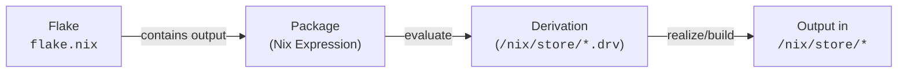

<h1 align="center">
    
    <br>
    <br>
    <br>Nix & NixOS Workshop
    <br>
</h1>

> [!CAUTION]
>
> This workshop is currently under development and is not yet complete.

This workshop is structured in 2 parts

- Part 1: Learn what a Nix DevShell is and how to extend it. It is designed to
  provide a **minimal, hands-on** introduction to how Nix works. While
  explanations are concise, they aim to be precise enough to help you grasp the
  objectives of this part.

  - Gain a basic understanding of the Nix language.
  - Learn what a `flake.nix` file is.
  - Understand what a Nix derivation is and how it materializes.

- Part 2: Building and running a basic NixOS system.
  - Requires Part 1.
  - Configure and build a NixOS system.
  - Deploy it to a cloud VM.

<!-- prettier-ignore-start -->


<!--toc:start-->
- [Requirements](#requirements)
- [Part 1 - Nix & Nix DevShell](#part-1-nix-nix-devshell)
  - [Introduction](#introduction)
    - [Learn Nix the Fun Way](#learn-nix-the-fun-way)
    - [What is a Flake? (`flake.nix`)](#what-is-a-flake-flakenix)
    - [How to Inspect a Flake?](#how-to-inspect-a-flake)
    - [What is a Nix Derivation?](#what-is-a-nix-derivation)
    - [What is an Installable?](#what-is-an-installable)
- [Part 2 - NixOS](#part-2-nixos)
    - [What is NixOS?](#what-is-nixos)
      - [The `nixosSystem` Function](#the-nixossystem-function)
  - [Build/Run & Understand a Simple VM](#buildrun-understand-a-simple-vm)
    - [Understand the Configuration](#understand-the-configuration)
<!--toc:end-->


<!-- prettier-ignore-end -->

> [!TIP]
>
> Due to the lack of well-structured and centralized official documentation on
> Nix topics, many external links to additional reading materials and videos are
> provided. Learning Nix can be challenging, but we prioritize linking to
> official documentation whenever relevant. Some useful resources include:
>
> - [Nix Packages Search](https://search.nixos.org/packages?)
> - [Nix Packages Search for Version Pinning](https://nixhub.io)
> - [NixOS Manual](https://nixos.org/manual/nixos/stable/)
> - [NixOS Options Search](https://search.nixos.org/options?)
> - [NixOS With Flakes](https://nixos-and-flakes.thiscute.world/nixos-with-flakes)
> - [NixOS Status](https://status.nixos.org/)
> - [Nixpkgs Pull Request Tracker](https://nixpk.gs/pr-tracker.html)
> - [Nixpkgs-Lib Function Search](https://noogle.dev/)

## Requirements

Ensure that you have installed
[`Nix`](https://swissdatasciencecenter.github.io/best-practice-documentation/docs/dev-enablement/nix-and-nixos#installing-nix)
and
[`direnv`](https://swissdatasciencecenter.github.io/best-practice-documentation/docs/dev-enablement/nix-and-nixos#installing-direnv).

The basic requirements for working with this repository are:

- `just`
- `nix`

## Part 1 - Nix, Flakes & Nix DevShell

Nix is a domain-specific functional language, structurally similar to JSON but
with functions. It supports fundamental data types such as `string`, `integer`,
`path`, `list`, and `attribute set`. For a more detailed explanation, see
[Nix Language Basics](https://nixos.org/guides/nix-pills/04-basics-of-language.html#basics-of-language).

> [!CAUTION]
>
> The Nix language is specifically designed for deterministic software building
> and distribution. Due to its narrow scope, it lacks certain features, such as
> floating-point types, which are unnecessary in this context.

Most `*.nix` files in this and other repositories define functions. You can
learn more about functions in Nix from
[this guide](https://nixos.org/guides/nix-pills/05-functions-and-imports.html).

For example, the function `args: /* implementation */` in `myfunction.nix` takes
one argument `args` and returns an attribute set `{ val1 = ... }`:

```nix
# File: `myfunction.nix`:
args:
let
  aNumber = 1;  # A number.
  aList = [ 1 2 3 "help"];  # A list with 4 elements.
  anAttrSet = { a = 1; b.c.d = [1]; };  # A nested attribute set.
  result = args.myFunc { val1 = aNumber; };  # Calls another function `args.myFunc`.
in
{ val1 = aNumber; val2 = anAttrSet.b.c.d; val3 = result; }
```

Watch this [short introduction](https://www.youtube.com/watch?v=HiTgbsFlPzs) to
get a better understanding on this basic building block.

> [!TIP]
>
> In Nix world everything is a function. And to to procedural-like statements
> you use `let ... in` blocks as shown above to better structure what return
> value you construct, instead of writing large one-liners.

All `*.nix` files you explore in this repository are exactly similar but the
attribute set they return will be specific to what the
[NixOS module system](https://nixos.org/manual/nixos/stable/#sec-writing-modules)
expects (see [part 2](#part-2-nixos)). More to that later.

### Learn Nix the Fun Way

You think, "jeah, yet another boring, simplistic language", but there is more to
it, especially why its functional in nature.

Lets go through the awesome slides from
[Farid Zakaria](https://fzakaria.github.io/learn-nix-the-fun-way/) to give you
the most promising introduction what Nix can do for 🫵. Stop at slide 9:

Lets build the derivation for the `what-is-my-ip` script (we will give you a
better understanding [in the next section](#what-is-a-nix-derivation)). Put the
following Nix function into a file
[`what-is-my-ip.nix`](./examples/whats-my-ip.nix):

```nix
{
system ? builtins.currentSystem,
pkgs ?
  import (fetchTarball "https://github.com/NixOS/nixpkgs/archive/9684b53175fc6c09581e94cc85f05ab77464c7e3.tar.gz") {
    inherit system;
  },
}:
pkgs.writeShellScriptBin "what-is-my-ip" ''
${pkgs.curl}/bin/curl -s http://httpbin.org/get | \
  ${pkgs.jq}/bin/jq --raw-output .origin
''
```

This function takes two parameters:

- `system`: a string mostly `x86_64-linux` and defaulted to your current system)
  and
- `pkgs`: an attribute set and defaulted to the main function of the `nixpkgs`
  repository. The repository `nixpkgs` is the central package mono-repository
  which maintains packages (_derivations_) for Nix.

Now build the _derivation_ (the result of the `pkgs.writeShellScriptBin`
function) by evaluating and building this Nix function with `nix build` with:

```bash
nix build -f what-is-my-ip.nix --print-out-paths

> /nix/store/7x9hf9g95d4wjjvq853x25jhakki63bz-what-is-my-ip
```

The `pkgs.writeShellScriptBin` is a **trivial builder** function around the
fundamental `derivation` command in the
[original script](examples/what-is-my-ip-orig.nix).

Explore what is inside this executable with:

```bash
cat /nix/store/7x9hf9g95d4wjjvq853x25jhakki63bz-what-is-my-ip/bin/what-is-my-ip

> #!/nix/store/mc4485g4apaqzjx59dsmqscls1zc3p2w-bash-5.2p37/bin/bash
> /nix/store/zl7h70n70g5m57iw5pa8gqkxz6y0zfcf-curl-8.12.1-bin/bin/curl -s http://httpbin.org/get | \
>  /nix/store/y50rkdixqzgdgnps2vrc8g0f0kyvpb9w-jq-1.7.1-bin/bin/jq --raw-output .origin
```

As you see Nix has encoded the executables used in the script by store paths
(`/nix/store`).

> [!NOTE]
>
> Do not think you can now simply share this script by giving the contents of
> directory `/nix/store/7x9hf9g95d4wjjvq853x25jhakki63bz-what-is-my-ip` to
> somebody else and it will work. This is not sufficient and is done
> differently, namely over Nix itself, because Nix has all information.

For that check the dependency graph with `nix-visualize`:

```bash
nix run github:craigmbooth/nix-visualize -- \
  -c tools/configs/nix-visualize/config.ini
  -s nix
  "$(nix build -f what-is-my-ip.nix --print-out-paths)"
```

and inspect the `frame.png`:


Since Nix knows all that and everything is maintained in the `/nix/store`, Nix
can trivially copy for example this script with all its dependencies into
another store.

Finish the slides to the end of the presentation.

---

### What is a Flake? (`flake.nix`)

A [`flake.nix`](./flake.nix) provides a **deterministic** way to manage
dependencies and configurations in Nix. In contrast to the function in
`what-is-my-ip.nix` which hard-codes the `pkgs` to a certain commit on the
`nixpkgs` repository, a flake is a better way to manage such locked inputs.

A flake references external Nix functions—called
[**inputs**](https://nixos-and-flakes.thiscute.world/nixos-with-flakes/nixos-flake-configuration-explained#_1-flake-inputs)—which
are fetched from other repositories, local files, or URLs. It also defines
structured
[**outputs**](https://nixos-and-flakes.thiscute.world/nixos-with-flakes/nixos-flake-configuration-explained#_2-flake-outputs),
specifying what the flake provides.

Each [`flake.nix`](./flake.nix) file consists of a **single attribute set** in
the form:

```nix
{
  inputs = { /* ... */ };
  outputs = inputs: { /* implementation */}
}
```

which contains:

- **Inputs**: An attribute set `inputs`, listing dependencies the flake relies
  on.
- **Outputs**: A function that takes all `inputs` and returns an
  [attribute set](https://nixos-and-flakes.thiscute.world/other-usage-of-flakes/outputs),
  specifying what the flake provides (e.g., packages, modules, or NixOS
  configurations).

For example, an _evaluated output_ (remember that `outputs` is a function) such
as `outputs.x86_64-linux.packages = ...` typically defines Nix **derivations**,
which are the core building blocks of Nix packages.

### How to Inspect a Flake?

You can run the Nix interpreter and load a flake in directory `.` and use tab
completion on output attributes like so:

```bash
nix repl .

> Nix 2.24.11
> Type :? for help.
> warning: Git tree '/persist/repos/nixos-workshop' is dirty
> Loading installable 'git+file:///persist/repos/nixos-workshop#'...
> Added 7 variables.
> nix-repl> # Type 'devShells.<TAB><TAB>'
```

Another method is to start the `nix repl` and then type `:lf .` which is almost
the same except that the available attributes are now `inputs` and `outputs`:

```bash
nix repl

> Nix 2.24.11
> Type :? for help.
> nix-repl> # Type ':lf .'

> warning: Git tree '/persist/repos/nixos-workshop' is dirty
> Added 18 variables.
> nix-repl> # Type 'outputs.devShells.<TAB><TAB>'
```

---

### What is a Nix Derivation?

A [derivation](https://nix.dev/manual/nix/2.24/glossary#gloss-derivation) is a
**specialized attribute set** that describes how to build a Nix package. In raw
form, it looks like `{ type = "derivation"; ... }` and carries a well-defined
structure with built-in meaning.

> A derivation is an instruction that Nix uses to realize a package. Created
> using a special `derivation` function in the Nix language, it can depend on
> multiple other derivations and produce one or more outputs. The complete set
> of dependencies required to build a derivation—including its transitive
> dependencies—is called a **closure**.
> [\[Ref\]](https://zero-to-nix.com/concepts/derivations)

When Nix evaluates a derivation, it stores the result in the Nix store
(`/nix/store`) as a **store derivation**
([more details](https://nix.dev/manual/nix/2.24/glossary#gloss-store-derivation)).

As several concepts are being introduced, here is a visual reference showing how
they relate to each other:



To inspect the `formatter.x86_64-linux` output from this repository’s
[`flake.nix`](./flake.nix), run the following command:

```bash
nix eval .#formatter.x86_64-linux

> «derivation /nix/store/72zknv2ssr8pkvf5jrc0g5w64bqjvyq1-treefmt.drv»
```

```bash
cat /nix/store/72zknv2ssr8pkvf5jrc0g5w64bqjvyq1-treefmt.drv

> Derive([("out","/nix/store/5rvqlxk2vx0hx1yk8qdll2l8l62pfn8n-treefmt","","")],[("/nix/store/1fmb3b4cmr1bl1v6vgr8plw15rqw5jhf-treefmt.toml.drv",["out"]),("/nix/store/3avbfsh9rjq8psqbbplv2da6dr679cib-treefmt-2.1.0.drv",["out"]),("/nix/store/61fjldjpjn6n8b037xkvvrgjv4q8myhl-bash-5.2p37.drv",["out"]),("/nix/store/gp6gh2jn0x7y7shdvvwxlza4r5bmh211-stdenv-linux.drv",["out"])],["/nix/store/v6x3cs394jgqfbi0a42pam708flxaphh-default-builder.sh"],"x86_64-linux","/nix/store/8vpg72ik2kgxfj05lc56hkqrdrfl8xi9-bash-5.2p37/bin/bash",["-e","/nix/store/v6x3cs394jgqfbi0a42pam708flxaphh-default-builder.sh"],[("__structuredAttrs",""),("allowSubstitutes",""),("buildCommand","target=$out/bin/treefmt\nmkdir -p \"$(dirname \"$target\")\"\n\nif [ -e \"$textPath\" ]; then\n  mv \"$textPath\" \"$target\"\nelse\n  echo -n \"$text\" > \"$target\"\nfi\n\nif [ -n \"$executable\" ]; then\n  chmod +x \"$target\"\nfi\n\neval \"$checkPhase\"\n"),("buildInputs",""),("builder","/nix/store/8vpg72ik2kgxfj05lc56hkqrdrfl8xi9-bash-5.2p37/bin/bash"),("checkPhase","/nix/store/8vpg72ik2kgxfj05lc56hkqrdrfl8xi9-bash-5.2p37/bin/bash -n -O extglob \"$target\"\n"),("cmakeFlags",""),("configureFlags",""),("depsBuildBuild",""),("depsBuildBuildPropagated",""),("depsBuildTarget",""),("depsBuildTargetPropagated",""),("depsHostHost",""),("depsHostHostPropagated",""),("depsTargetTarget",""),("depsTargetTargetPropagated",""),("doCheck",""),("doInstallCheck",""),("enableParallelBuilding","1"),("enableParallelChecking","1"),("enableParallelInstalling","1"),("executable","1"),("mesonFlags",""),("name","treefmt"),("nativeBuildInputs",""),("out","/nix/store/5rvqlxk2vx0hx1yk8qdll2l8l62pfn8n-treefmt"),("outputs","out"),("passAsFile","buildCommand text"),("patches",""),("preferLocalBuild","1"),("propagatedBuildInputs",""),("propagatedNativeBuildInputs",""),("stdenv","/nix/store/hsxp8g7zdr6wxk1mp812g8nbzvajzn4w-stdenv-linux"),("strictDeps",""),("system","x86_64-linux"),("text","#!/nix/store/8vpg72ik2kgxfj05lc56hkqrdrfl8xi9-bash-5.2p37/bin/bash\nset -euo pipefail\nunset PRJ_ROOT\nexec /nix/store/0jcp33pgf85arjv3nbghws34mrmy7qq5-treefmt-2.1.0/bin/treefmt \\\n  --config-file=/nix/store/qk8rqccch6slk037dhnprryqwi8mv0xs-treefmt.toml \\\n  --tree-root-file=.git/config \\\n  \"$@\"\n\n")])
```

The output of `/nix/store/72zknv2ssr8pkvf5jrc0g5w64bqjvyq1-treefmt.drv` above is
the internal serialization of the formatter's derivation which **when built**
can be used to format all files in this repository.

> [!NOTE]
>
> A derivation contains only build instructions for Nix to realize/build it.
> This can be literally anything, e.g. a software package, a wrapper shell
> script or only source files.

We can build the above derivation - or in other terms **realize it in the Nix
store** - by doing:

```bash
nix build /nix/store/72zknv2ssr8pkvf5jrc0g5w64bqjvyq1-treefmt.drv
```

or

```bash
nix build ".#formatter.x86_64-linux"
# Use quoted strings here (`zsh` interprets # differently!"
```

This will by default produce a symlink `./result` pointing to the Nix store
where this executable is available. Lets inspect it with:

```bash
ls -ald ./result

> Permissions Size User  Date Modified Name
> lrwxrwxrwx     - nixos 23 Mar 18:18   ./result -> /nix/store/5rvqlxk2vx0hx1yk8qdll2l8l62pfn8n-treefmt

tree /nix/store/5rvqlxk2vx0hx1yk8qdll2l8l62pfn8n-treefmt

> /nix/store/5rvqlxk2vx0hx1yk8qdll2l8l62pfn8n-treefmt
> └── bin
>     └── treefmt
```

You can run it by doing

```bash
nix/store/5rvqlxk2vx0hx1yk8qdll2l8l62pfn8n-treefmt/bin/treefmt -h
```

---

### What is an Installable?

The path `.#formatter.x86_64-linux.treefmt` mentioned in the previous section is
commonly referred to as a
[Flake output attribute installable](https://nix.dev/manual/nix/2.24/command-ref/new-cli/nix#flake-output-attribute),
or simply an
[_installable_](https://nix.dev/manual/nix/2.24/command-ref/new-cli/nix#installables).

An **installable** is any Flake output that can be realized in the Nix store.

Breaking down `.#formatter.x86_64-linux.treefmt`:

- `.` refers to this repository’s [`flake.nix`](./flake.nix).
- `formatter.x86_64-linux.treefmt` following `#` is an output attribute defined
  within the flake.

Most
[modern Nix commands](https://nix.dev/manual/nix/2.24/command-ref/experimental-commands)
accept installables as input, making them a fundamental concept in working with
Flakes. **You should only use the modern commands, e.g. `nix <subcommand>`**.
Stay away from the command`nix-env`.

> [!TIP]
>
> Although Nix Flakes are still considered experimental,
> [there's no harm in using them](https://jade.fyi/blog/flakes-arent-real).
> Despite ongoing discussions within the Nix community, Flakes are expected to
> be stabilized in the future.

---

## Part 2 - NixOS

#### What is NixOS?

A NixOS derivation is created by a function `inputs.nixpkgs.lib.nixosSystem`
which comes from the [Nixpkgs Flake](https://github.com/NixOS/nixpkgs). The
`nixpkgs` repository is the mono-repository which maintains more than 130'000
software packages. These packages are defined - by nothing more than (you
guessed it) - Nix functions which return derivations.

##### The `nixosSystem` Function

The `inputs.nixpkgs.lib.nixosSystem` function will produce a derivation which
you can evaluate. For example - in this repository's
[`flake.nix`](./flake.nix) - the attribute
`nixosConfigurations.x86_64-linux.vm-simple` is such a function invocation and
to evaluate it you can run:

```bash
nix eval ".#nixosConfigurations.vm-simple.config.system.build.toplevel"
```

or you **better build** it with

```bash
nix build ".#nixosConfigurations.vm-simple.config.system.build.toplevel"
```

which will take some time and the resulting Nix store path linked by `./result`
then contains the built OS:

```bash
tree -L 2 ./result

> ./result
> ├── activate
> ├── append-initrd-secrets -> /nix/store/ccyny0nr3a4dn5f864caj1nmvhkyz938-append-initrd-secrets/bin/append-initrd-secrets
> ├── bin
> │   └── switch-to-configuration
> ├── boot.json
> ├── configuration-name
> ├── dry-activate
> ├── etc -> /nix/store/34f7cw087r9js5c1f3snwra466p03rjv-etc/etc
> ├── extra-dependencies
> ├── firmware -> /nix/store/28a2j3qirvnzjrzwahgqpl6d83p4dibb-firmware/lib/firmware
> ├── init
> ├── init-interface-version
> ├── initrd -> /nix/store/rhk5xymxhaap08abmvy8fspcfm3ghyf1-initrd-linux-6.6.82/initrd
> ├── kernel -> /nix/store/7c8qjbmxyyyscapv46cprwg3h1i0ry8b-linux-6.6.82/bzImage
> ├── kernel-modules -> /nix/store/5r9yn7mgianbqlqdn649k647v7zn6k9w-linux-6.6.82-modules
> ├── kernel-params
> ├── nixos-version
> ├── specialisation
> ├── sw -> /nix/store/v71rhhllsl7av7nrkzb58snsb2c7fal1-system-path
> ├── system
> └── systemd -> /nix/store/w9qcpyhjrxsqrps91wkz8r4mqvg9zrxc-systemd-256.10
```

The above (to my best knowledge) in simple terms contains everything needed to
boot into this NixOS system. An
[activation script `activate`](https://nixos.org/manual/nixos/stable/#sec-activation-script)
prepares symlinks into the immutable `/nix/store` on folders like

- `/boot` (kernel and bootloader),
- `/etc` (system configuration files), -`/var` (variable data) ,
- `/run` (ephemeral runtime data),
- `/home` (home directories)
- etc.

[`switch-to-configuration`](https://nixos.org/manual/nixos/stable/#sec-switching-systems)
script also takes care to switch to the new system on a running system and
restart the appropriate `systemd` services.

The next section explains how to build/run & understand a simple NixOS VM setup.

### Build/Run & Understand a Simple VM

First familiar yourself with the commands on the [`justfile`](./justfile) with
by running `just`. The `build` and `repl` commands, we have covered in the
introduction.

In this example we are going to build a simple VM with just a user `nixos` and
without a graphical desktop environment.

```bash
cp ./.env.tmpl .env
## Modify the .env file to have `NIXOS_HOST=vm-simple`
```

#### Understand the Configuration

The [`./nixos/hosts/vm-simple/default.nix`](./nixos/hosts/vm-simple/default.nix)
contains one function which returns the NixOS system:

```nix
{ inputs, outputs, ... }:
inputs.nixpkgs.lib.nixosSystem {
  system = "x86_64-linux";
  modules = [
    ./hosts/vm/configuration.nix
  ];
  specialArgs = {
    inherit inputs outputs;
  };
}
```

The function call `inputs.nixpkgs.lib.nixosSystem {...}` is a function defined
in [`nixpgs`](https://github.com/NixOS/nixpkgs) which will generate a Nix
derivation.

When we instruct Nix to build this derivation, the derivation gets realized in
the Nix store (e.g. in `/nix/store`).
